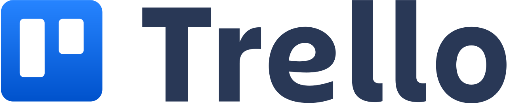

# Strumenti utilizzati

Come supporto delle pratiche del DDD durante tutto il progetto sono stati utilizzati diversi strumenti con lo scopo di agevolare e rendere più produttivo il team e l'interazione con gli esperti di dominio. 

Di seguito verranno descritti i principali strumenti associando ognuno di essi allo scopo per cui è stato utilizzato e suddividendoli

## Knowledge crunching

### Egon.io

[Egon.io](https://egon.io/) è un tool di supporto al Domain Storytelling. 

Esso è stato utilizzato dal team per rappresentare, attraverso un linguaggio pittografico, le Domain stories raccontate dagli esperti di dominio durante i processi di Knowledge Crunching.

### Miro

[Miro](https://miro.com/it/) è una piattaforma di collaborazione digitale online progettata per facilitare la comunicazione, la gestione dei progetti e il modelling in team remoti e non. Fornisce agli utenti la possibilità di lavorare contemporaneamente collaborando in real-time.

Esso è stato utilizzato dal team, per quanto riguarda il Knowledge Crunching, per la creazione di mind-map e l'analisi del dominio mediante diagrammi di casi d'uso e Core Domain Charts. Sfruttando la funzionalità di collaborazione in real-time, è stato possibile ricevere feedback immediati da parte degli esperti del dominio e dei vari componenti del team.

## Project site

### Confluence

[Conflunce](https://www.atlassian.com/it/software/confluence) è una piattaforma collaborativa progettata per consentire ai team di lavorare e condividere informazioni in modo efficace ed efficiente. Fornisce uno spazio di lavoro online in cui è possibile creare, organizzare e discutere documenti, pagine web, note di riunione ecc...

Esso è stato utilizzato dal team, come anticipato, per la realizzazione del sito di progetto da condividere con i vari stakeholders ed esperti di dominio al fine di creare un unico punto nel quale la conoscenza converge ed evolve in modo organizzato ed accessibile da parte di tutti in modo agevole.

## Project management

### Trello

[Trello](https://trello.com/it) è una piattaforma di gestione delle attività online che consente ai team di organizzare e collaborare su progetti in modo visuale.

Esso è stato utilizzato dal team come *Sprint Task Board* al fine di rappresentare e monitorare l'avanzamento dei task durante i vari sprint.

### Notion

[Notion](https://www.notion.so/) è un'applicazione per la produttività e la gestione delle informazioni che consente agli utenti di creare e organizzare contenuti in maniera flessibile attraverso uno spazio di lavoro libero e su cui i vari utenti possono collaborare simultaneamente in real-time.

Esso è stato utilizzato dal team per raccogliere tutta la documentazione di progetto interna e per l'organizzazione dei vari sprint settimanali.

## Modelling

### Miro

[Miro](https://miro.com/it/), descritto precedentemente, è stato utilizzato dal team anche come software di modellazione durante il design del sistema. In particolare ci ha permesso di creare diagrammi UML e schemi architetturali del sistema.

### Context Mapper

[Context Mapper](https://contextmapper.org/) è un framework di modellazione per il design strategico (e tattico) del Domain Driven Design.

Esso è stato utilizzato dal team per la formalizzazione e la descrizione dei sottodomini, dei Bounded Context, della Context Map e dei modelli di dominio.

### PlantUML

[PlantUML](https://plantuml.com/) è uno strumento per la creazione di diagrammi UML utilizzando una descrizione semplice e human-readable.

Esso è stato utilizzato dal team per la creazione dei diagrammi delle classi dei vari sottodomini esportati dal tool Context Mapper descritto precedentemente.

### LucidChart

[LucidChart](https://www.lucidchart.com/) è una piattaforma digitale che consente agli utenti di collaborare visivamente per la modellazione e la condivisione di diagrammi e grafici.

Esso è stato utilizzato dal team per la progettazione dei task concorrenti modellati tramite EFSM effettuata per la Centralina di zona (Arduino). Si è preferito utilizzare questo tool al posto di Miro in quanto possiede un maggior supporto per la modellazione di questo tipo di diagrammi.

### Figma

[Figma](https://www.figma.com/) è un editor di grafica vettoriale e uno strumento di prototipazione collaborativo che permette la progettazione di interfacce grafiche in modo agevole.

Esso è stato utilizzato dal team per la creazione dei mockup interattivi delle dashboard e per il design del logo del sistema.

