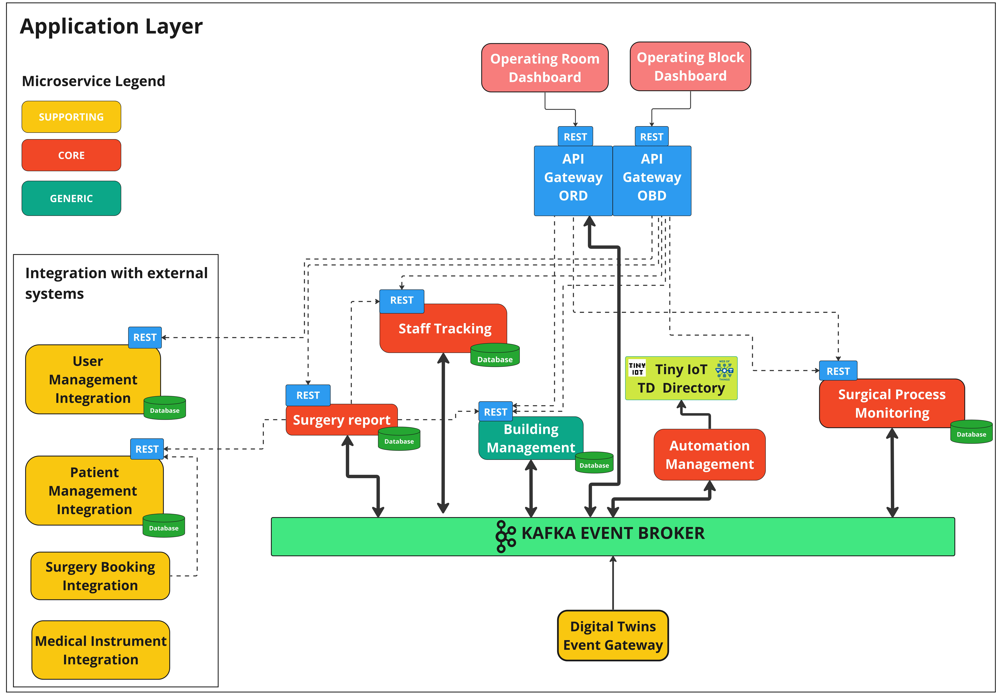

# Application Layer

L'Application layer, contenente la business logic e tutti i casi d'uso del sistema, è stato progettato attraverso un'**architettura a microservizi event-driven**.

La scelta dell'architettura a microservizi parte dalla volontà di ridurre la complessità suddividendo il dominio del problema attraverso modelli più piccoli che siano più facilmente gestibili e che, confinando i cambiamenti, siano più manutenibili, evitino l'ambiguità e rispettino il principio SRP (Single responsibility principle). I microservizi hanno il vantaggio, rispetto a una soluzione con un monolite, di poter adottare, per ogni microservizio, lo stack tecnologico desiderato. Infatti si parla di *Polyglot governance*, per le tecnologie, *Polyglot modelling*, per i modelli concettuali e *Polyglot persistence*, per le decisioni relative alla persistenza. Inoltre, ognuno di essi viene progettato, implementato e versionato autonomamente rendendo possibile il deploy e lo scaling di essi in modo indipendente.

Per la progettazione dell'architettura sono state seguite le best-practices definite dal *DDD* partendo dalla definizione dei diversi *Bounded Context* e dalle loro relazioni all'interno della Context Map.

In <a href="#applicationLayerArchitecture">Figura 1</a> è possibile notare i microservizi sviluppati e le loro interazioni.

Sono stati individuati nove microservizi principali, uno per ciascun Bounded Context identificato:

- *Building Management*: è il servizio che si occupa del monitoraggio del blocco operatorio e della sua gestione in termini di creazione e disposizione delle stanze e delle tecnologie mediche.
- *Staff Tracking*: si occupa della memorizzazione della storia degli spostamenti dei professionisti sanitari all'interno del blocco operatorio. Sopra a questi dati abilita la possibilità di eseguire query più complesse in modo da ottenere, a partire dagli spostamenti, le informazioni desiderate.
- *Automation Management*: è responsabile per tutte le automazioni all'interno del blocco operatorio. Nelle automazioni sono incluse sia quelle di gestione per l'ottimento di condizioni ambientali ottimali (temperatura, umidità, luminosità e standby mode) sia quelle relative alle automazioni che supportano i professionisti sanitari durante le loro operazioni (adattamento dell'ambiente con le migliori condizioni per l'utilizzo di una tecnologia medica) sia quelle richieste dal personale sanitario.
- *Surgical Process Monitoring*: è il servizio che si occupa del monitoraggio dei processi chirurgici in corso all'interno del blocco operatorio raccogliendo tutti i dati necessari per rappresentare l'intervento associato.
- *Surgery Report*: è il servizio che si occupa, a partire da tutti i dati raccolti dai vari microservizi, della generazione automatica del report dell'intervento. Inoltre prevede anche la possibilità, da parte di un professionista sanitario, di effettuare l'integrazione con parti aggiunte manualmente.
- *User Management Integration*, *Patient Management Integration*, *Surgery Booking Integration* e *Medical Instrument Integration*: questi sono i servizi necessari per l'integrazione con i sistemi legacy presenti nella struttura ospedaliera. I servizi di integrazione indicati si occupano rispettivamente di: ottenere le informazioni rispetto ai professionisti sanitari, ottenere i dati anagrafici relativi ai pazienti, ottenere i dati relativi alle prenotazioni e alla calendarizzazione degli interventi chirurgici ed infine di integrarsi con i sistemi di telemetria per l'ottenimento dei parametri vitali dei pazienti.

Per quanto riguarda il bounded-context *Issue Management*, si è deciso di non progettarne il relativo microservizio, lasciandolo comunque nell'analisi iniziale sul sito di progetto per un eventuale sviluppo futuro.

Si può notare la presenza di un *API Gateway* il quale ricopre il ruolo di entry point nel sistema per le chiamate di client esterni; nel nostro caso delle dashboard di blocco e di sala operatoria. La responsabilità di un API Gateway è quella di tradurre le richieste "client-friendly" effettuate al sistema dall'esterno nei protocolli utilizzati internamente all'architettura del sistema. L’API Gateway sviluppato implementa anche il pattern *API Composition* agendo da façade e semplificando l’accesso alle informazioni del sistema.

Ogni microservizio - che necessita di mantenere dello stato - seguendo le best-practice, mantiene i dati privati, in un proprio database. I microservizi non devono avere database condivisi in quanto i dati devono essere scambiati tramite eventi o richieste esplicite. Per tutti i microservizi progettati è risultato particolare efficace l’utilizzo di database documentali, in particolare di [MongoDB](https://www.mongodb.com).

Per quanto riguarda l'interazione tra microservizi, considerando la natura e i requisiti del sistema, si è scelto di adottare una comunicazione *event-driven* per tutto ciò che riguarda il flow del processo chirurgico e l'osservazione del Digital Twins layer.
Tuttavia, l'approccio event-driven non è adatto all'interazione con i sistemi di integrazione e sopratutto alla maggior parte delle composizioni di API che l'API Gateway risolve. Perciò in questi casi si è optato per una comunicazione basata su richiesta-risposta sincrona one-to-one sfruttando *API REST*.

Considerando la necessità di un *Event Broker* e non di un semplice *Message Broker* e le varie caratteristiche dei sistemi commerciali tra cui: il supporto della community, le funzionalità e i tool a disposizione è stato scelto *[Apache Kafka](https://kafka.apache.org)*.

Tutti i microservizi sviluppati sono stati realizzati seguendo i principi della *Clean Architecture*, descritta in <a href="#cleanArchitecture">Figura 2</a> la quale ha permesso di separare correttamente la modellazione del dominio, i casi d’uso, la logica applicativa e tutto ciò che riguardava le tecnologie e l’infrastruttura, grazie al rispetto dei layers e della *dependency rule*. L’impiego di questa tipologia di architettura ha permesso di creare microservizi più facilmente testabili, estendibili e manutenibili.

Sono stati utilizzati i quattro layers descritti nell'[articolo](https://blog.cleancoder.com/uncle-bob/2012/08/13/the-clean-architecture.html) di *Robert C. Martin*:

- *Entity layer*: contiene tutti gli elementi di dominio. È il layer centrale, più stabile e quindi meno volatile di ogni microservizio e i concetti definiti al suo interno sono completamente indipendenti da tutto ciò che è definito nei layers esterni risultando così disaccoppiato dalle tecnologie e dalle librerie utilizzate.
- *Use case layer*: contiene tutti i casi d'uso del sistema. Essi utilizzano solamente i concetti di dominio definiti nell'*Entity layer* più interno agendo da orchestratori delle entità incapsulando le politiche di business. Permettono così di astrarre i dettagli degli elementi di dominio dietro ad un API coarse-grained che rispecchia i casi d'uso del sistema. Questo permette di eseguire *unit-test* sui casi d'uso del sistema senza avere dipendenze dall'infrastruttura.
- *Application layer*: contiene i *controller* e i *presenter*. I primi gestiscono l'orchestrazione del flusso dell'applicazione gestendo l'interazione tra gli attori esterni e le politiche di business definite nel core. Essi quindi non rappresentano concetti di dominio ne tanto meno definiscono regole di business. I secondi si occupano della serializzazione e della deserializzazione, quindi della presentazione, dei dati verso il layer infrastrutturale o il layer dei casi d'uso, adattando quindi i dati al formato più conveniente per i layer interessati.
- *Infrastructure layer*: contiene tutte le scelte tecnologiche del sistema. Esse vengono confinate nel layer più esterno in quanto più volatili permettendo così a tutto ciò che viene definito nei layer più interni di rimanere valido anche a fronte di cambi tecnologici, assicurando maggiore flessibilità al sistema. 

Nel caso in cui, i layer interni avessero bisogno, per far fronte alle proprie responsabilità, di interagire con astrazioni definite nei layer superiori, come definito nell'[articolo](https://blog.cleancoder.com/uncle-bob/2012/08/13/the-clean-architecture.html) sulla *Clean Architecture*, si sfrutta il principio *Dependency Inversion (DIP)* per far si che le dipendenze vadano solo verso l'interno. Ogniqualvolta si presentava il problema si è definita un'interfaccia nel layer interno che poi viene implementata nel layer esterno. In questo modo le dipendenze rimangono solamente verso l'interno, senza dipendere da concetti definiti nei layer esterni.

Al fine di agevolare l'implementazione del modello del dominio cercando di mappare i concetti all'interno del codice rispettando l'*Ubiquitous Language*, si è fatto uso di alcuni elementi del *design tattico* definiti all'interno del *Domain-Driven Design*. 

- *Value object*: abbiamo sfruttato i *Value object* per rappresentare tutti quei concetti che non hanno un'identità e non cambiano nel tempo. Il tipico utilizzo di essi è per rappresentare lo stato delle *Entity*. Essi fanno parte dell'*Entity layer*.
- *Entity*: abbiamo sfruttato le *Entity* per rappresentare tutti i concetti di dominio dotati d'identità. Esse sono spesso utilizzate in combinazione con i *Value Object* per la creazione di modelli di dati complessi e la rappresentazione del comportamento e dello stato del sistema. Essi fanno parte dell'*Entity layer*.
- *Domain services*: abbiamo sfruttato le caratteristiche dei *Domain services* nell'implementazione dei casi d'uso del sistema al fine di gestire la coordinazione degli elementi di dominio. Essi fanno parte dell'*Use case layer*.
- *Repository*: abbiamo sfruttato i *Repository*, i quali fungono da intermediari tra il modello di dominio e la persistenza dei dati offrendo un'interfaccia più espressiva e orientata al dominio. Essi nascondono la complessità della tipologia di persistenza e del framework sottostante evitando che il modello del dominio dipenda dal modello dei dati (che comporterebbe una perdita di conoscenza). Nel nostro caso, utilizzando un database documentale, in particolare MongoDB, è stato possibile mappare direttamente il modello del dominio nel modello dei dati senza effettuare conversioni e rendendo così più semplice l'implementazione dei *Repository*. Solitamente l'interfaccia di essi viene definita nell'*Entity layer* o nell'*Use case layer* e l'implementazione nell'*Infrastructure layer*.