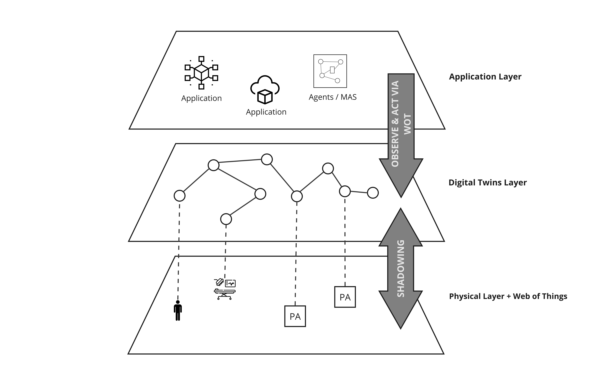

# Design

Dopo aver analizzato in dettaglio i requisiti del sistema ed aver compreso i processi interni ad un blocco operatorio si è passati alla fase di progettazione. In questo capitolo si fornirà una panoramica sulla divisione in layers del sistema complessivo dandone una descrizione generale per poi scendere nel dettaglio delle scelte di design di ognuno di essi.

## Design architetturale ad alto livello

In <a href="#simpleArchitecture">Figura 1</a> è possibile notare la suddivisione in layer caratterizzante il sistema in esame. 

L'obiettivo del nostro design è proporre una soluzione che sia indipendente da specifiche scelte tecnologiche e che si concentri solamente sui paradigmi e sulle tecniche offrendo un maggior grado di astrazione ed un sistema maggiormente estendibile e manutenibile.

Si nota la presenza di tre layers principali: il **Physical layer**, il **Digital Twins layer** e l'**Application layer**.

Il *Physical layer* si occupa della gestione di tutta la parte fisica del blocco operatorio. Esso include la gestione dei sensori e degli attuatori disposti in modo pervasivo e il controllo di essi attraverso opportuni microcontrollori e SoC.
Il *Digital Twins layer* consente di replicare il mondo reale in un mondo digitale, rappresentando ogni asset fisico appartenente alla realtà come Digital Twin <a href="#1">[1]</a> nello spazio virtuale in modo tale da avere una copia sempre aggiornata su cui abilitare qualsiasi worker - applicazione, agente, ecc... - che, osservando il mondo digitale, possa prendere decisioni come se le stesse prendendo osservando il mondo reale, attraverso quindi una sua astrazione. Con asset fisico non si intende solo ciò che ha effettivamente una rappresentazione concreta nella realtà. Infatti, include tutto ciò che è fisico come risorse o oggetti ma anche luoghi, persone e soprattutto attività e processi. Quindi ogni asset strategico per un’organizzazione deve avere una sua controparte digitale.
Il processo che si occupa dell'aggiornamento continuo in real-time o near real-time dei Digital Twins con le informazioni provenienti dagli asset fisici viene chiamato *shadowing*.
Questo layer inserisce un livello di astrazione importantissimo che permette al livello applicativo di essere completamente indipendente da ciò che avviene realmente nel mondo fisico. I servizi quindi agiscono solamente sull'astrazione digitale la quale presenta un modello contestualizzato allo scopo del sistema.
Perciò, in questo contesto, tutta la business logic e i casi d'uso del sistema risiedono nell'*Application layer* il quale può essere progettato indipendentemente da ciò che vi è ai livelli di astrazione inferiori. In questo layer trovano spazio quindi le applicazioni - servizi, microservizi, ecc... - e anche tutta la parte decisionale. In particolare, oltre ai servizi tradizionali l'architettura abilita l'utilizzo di *Agent Oriented Programming* (AOP) e *MultiAgent Programming* (MAP) attraverso agenti logicamente situati all'interno dell'ambiente modellato tramite *Digital Twins*.

Tuttavia, come si può notare, si fa impiego anche del concetto e dell'insieme di standard che sono inclusi sotto il nome di *Web of Things* <a href="#2">[2]</a>. Quest'ultimo è necessario per poter porre rimedio ad una problematica che affligge le principali soluzioni commerciali e non, conosciute ad oggi, per il layer di *Digital Twins*: la mancanza della componente bidirezionale che permette l'esecuzione di azioni sui *Digital Twins* stessi - come se la si stesse eseguendo sul mondo reale - e della proprietà dell'augmentation. Con augmentation si intende la possibilità che un *Digital Twin* di un asset fisico abbia delle funzioni aggiuntive che la controparte fisica non presenta in nessuna versione sfruttando il livello di astrazione offerto dal software. L'augmentation e il canale di comunicazione bidirezionale con il corrispettivo asset fisico sono proprietà e caratteristiche che contraddistinguono la visione moderna dei Digital Twins <a href="#1">[1]</a><a href="#3">[3]</a>, ma che, ad oggi e al massimo della nostra conoscienza, non sono ancora completamente sviluppate nelle soluzioni commerciali.

Nella progettazione di questo sistema viene proposta una possibile soluzione che vede l'utilizzo di entrambi i concetti, i *Digital Twins* e *Web of Things*, che, lavorando in modo consistente tra loro, permettono di far fronte alla problematica descritta in precedenza risolvendo al tempo stesso anche il problema dell'eterogeneità delle tecnologie utilizzate - nel caso in esame degli attuatori - facendo uso degli standard web moderni. 

Il layer di *Digital Twins* viene utilizzato per avere un'astrazione digitale in near real-time del mondo reale in cui l'*Application layer* può essere situato. Invece, gli standard di *Web of Things* vengono utilizzati, sempre dall'*Application layer*, per agire sugli attuatori presenti all'interno del blocco operatorio. L'integrazione e la consistenza tra le due rappresentazioni è necessaria per fornire entrambi i servizi: discovery degli attuatori, dato dal livello di *Digital Twins*, e utilizzo di essi, dato dallo standard *Web of Things*.

Nelle seguenti sotto sezioni si procederà ad una descrizione più dettagliata di ogni layer.

## Riferimenti

<a id="1">[1]</a> R Minerva, GM Lee, and N Crespi.
     Digital twin in the iot context: a survey on technical features, scenarios and architectural models. Proceedings of the IEEE, 2020.

<a id="2">[2]</a> M. Kovatsch, R. Matsukura, M. Lagally, T. Kawaguchi, K. Toumura, and K. Kajimoto. 
     Web of things (wot) architecture. https://www.w3.org/TR/2020/REC-wot-architecture-20200409/

<a id="3">[3]</a> Alessandro Ricci, Angelo Croatti, Stefano Mariani, Sara Montagna, and Marco Picone. 
     Web of digital twins. ACM Trans. Internet Technol., 22(4), nov 2022.
