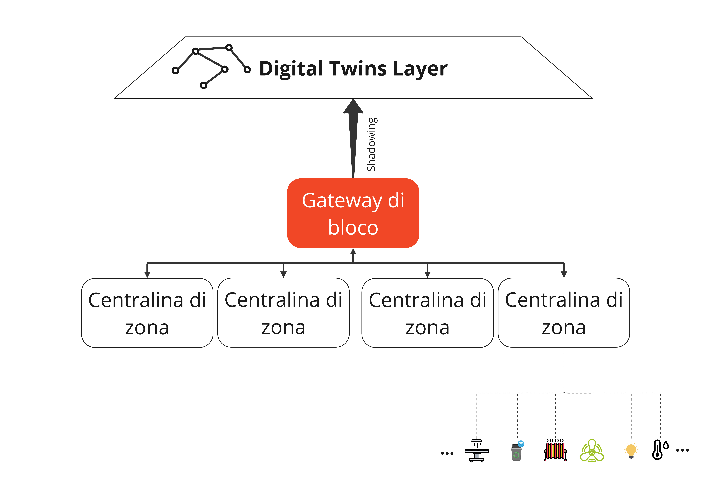
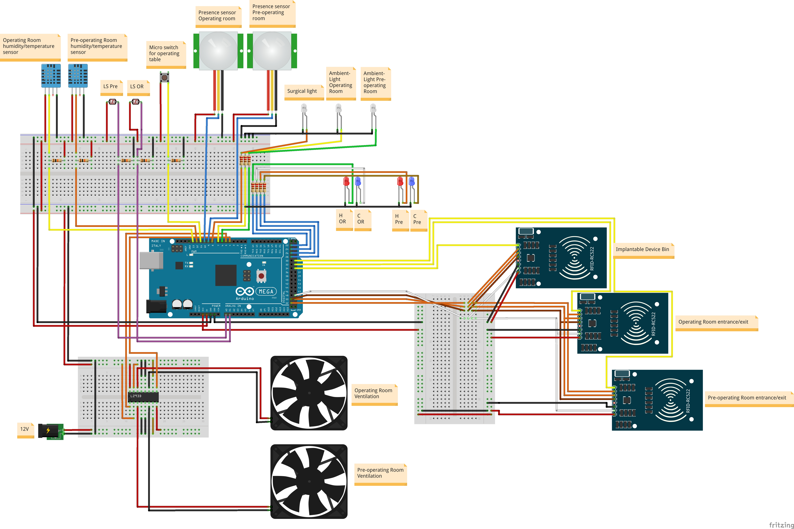
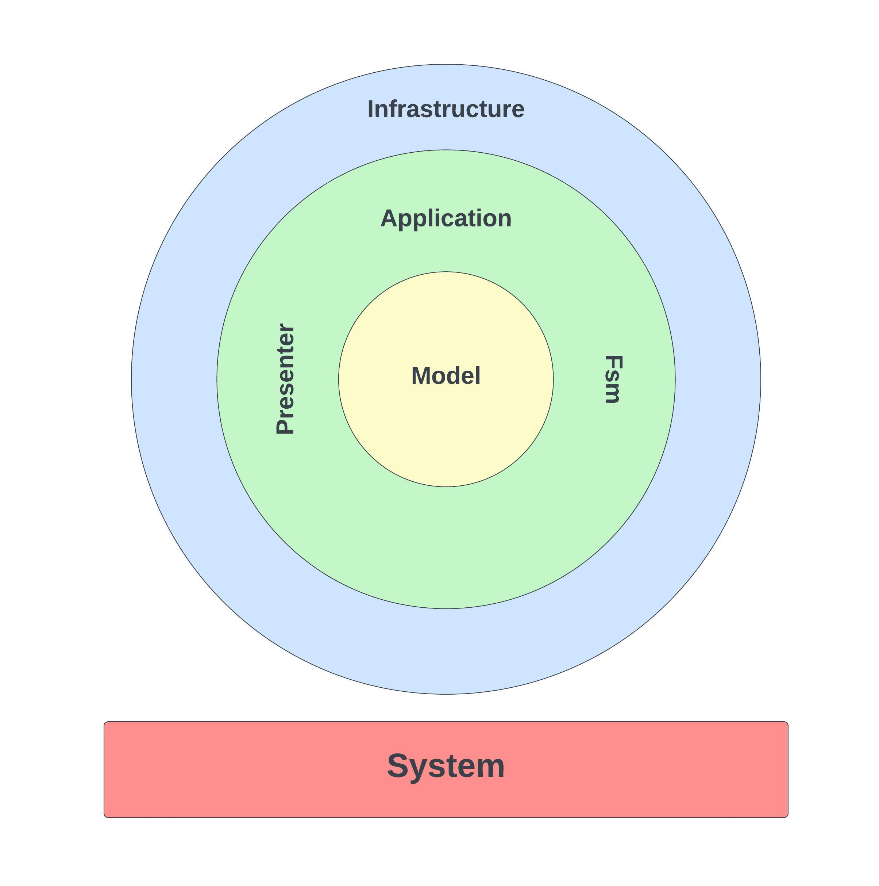

# Physical Layer

Il Physical layer, come anticipato, si occupa della gestione e del controllo di tutta la parte fisica - sensori e attuatori - del blocco operatorio.

Inoltre è l'attore principale nel processo di shadowing con i *Digital Twins* ed è responsabile della corretta esposizione degli entry-point definiti nelle *Thing Descriptions* <a href="#1">[1]</a> per gli attuatori.

Il *Physical layer*, descritto in <a href="#physicalLayerSchema">Figura 1</a>, è governato da due componenti principali:

- **Centralina di zona**: realizzata con *Arduino Mega 2560*, si occupa del monitoraggio di una zona e dell'invio effettivo dei comandi agli attuatori. La centralina di zona non è dotata di alcuna intelligenza, ne tantomento di controllo. Infatti, agisce solamente come scheda di raccolta dati e di esecuzione di comandi senza prendere alcun tipo di decisione e senza essere consapevole dei processi che avvengono all'interno del blocco operatorio. In generale essa si occupa dei seguenti compiti:
  
  - Monitoraggio dei valori ambientali: temperatura, umidità, luminosità ambientale e presenza persona. Al fine di essere significativi nelle letture ognuno di questi valori necessita di periodi diversi di aggiornamento.
  - Tracciamento degli spostamenti delle persone: è necessario tracciare le entrate e le uscite dei professionisti sanitari e dei pazienti. Non è necessario un sistema di real-time tracking all'interno delle singole stanze.
  - Tracciamento dei dispositivi medici impiantabili: è necessario tracciare l'utilizzo dei dispositivi medici impiantabili. All'interno di ogni sala operatoria vi è un cassonetto intelligente in grado di tracciare le confezioni dei dispositivi medici impiantabili che vengono utilizzati. Questo cassonetto ha un collegamento diretto con la centralina di zona.
  - Monitoraggio della presenza del paziente sul tavolo operatorio: all'interno della sala operatoria vi è anche un tavolo operatorio intelligente dotato di un sensore di pressione atto a comprendere la presenza del paziente sopra di esso. Il tavolo operatorio intelligente ha un collegamento diretto con la centralina di zona.
  - Esecuzione dei comandi provenienti dai layers superiori: riceve i comandi dai layers superiori, dove risiedono il potere e le capacità decisionali e li trasforma nelle azioni appropriate. Le azioni riguardano: gestione del sistema di riscaldamento, raffredamento, ventilazione (per la regolazione dell'umidità), luci ambientali e luci presenti sopra al tavolo operatorio.
  - Comunicazione dello stato al Gateway di blocco: i dati raccolti e lo stato degli attuatori dopo l'esecuzione dei comandi devono essere comunicati in real-time al Gateway di blocco il quale si occuperà del processo di shadowing.
  
- **Gateway di blocco**: ogni centralina di zona viene collegata tramite interfaccia seriale al Gateway di blocco, realizzato con *Raspberry Pi 4 model B*. 
  
  Esso si occuperà di:
  
  - Effettuare lo *shadowing*: è il responsabile della gestione dello shadowing dello stato delle varie zone sul Digital Twins layer.
  - *Gateway Web of Things*: si è deciso di adottare l'architettura con *gateway* definita all'interno dello standard Web of Things <a href="2">[2]</a> .

Questo permette alla Centralina di zona e quindi ai sensori e agli attuatori di non doversi preoccupare di questioni di più alto livello come l'implementazione e l'utilizzo dei protocolli web necessitando così di una potenza computazionale ridotta con conseguente risparmio di energia. In aggiunta ha permesso l'utilizzo di hardware più economico e una separazione delle responsabilità che favorisce l'estendibilità e la manutenibilità del sistema così creato.
Per quanto riguarda la Centralina di zona, progettata sfruttando Arduino Mega,  è riportato lo schema di collegamento in <a href="#roomControlUnitScheme">Figura 2</a>.

La centralina di zona non necessita di vincoli hard real-time perciò non è stato necessario l'impiego di un *RTOS* (con conseguente utilizzo di una board più potente rispetto ad Arduino Mega). Semplicemente, sfruttando il *super loop* messo a disposizione dal framework *Wiring* di Arduino si è deciso di progettare un semplice scheduler dinamico multi-tasking cooperativo con scheduling round-robin single-threaded che gestisse le responsabilità di essa.

Al fine di gestire il codice sviluppato garantendo l'estendibilità e la manutenibilità è stato seguito l'insieme di principi dettati dalla *Clean Architecture*, organizzando il sistema come descritto in <a href="#cleanArchitectureArduino">Figura 3</a>.

Essa si contraddistingue per la *dependency rule* che impedisce ad un layer interno di fare riferimento ad un layer più esterno. Questo permette di isolare i vari layer in modo ottimale e rappresentare nel migliore dei modi il modello e i casi d'uso del sistema.

Si può notare come, oltre alla mancanza del layer dei casi d'uso vista la semplicità, i layer siano supportati da un blocco chiamato *System*. In esso vi è il "sistema operativo base" che include lo scheduler e il gestore del risparmio energetico.Come anticipato, il comportamento del sistema viene gestito da uno scheduler. 

Al fine di avere una maggiore modularità ed estendibilità del sistema e per decomporre e gestire meglio la complessità si è scelta una suddivisione in task del comportamento. Ogni task rappresenta un compito ben definito, una unità di lavoro da svolgere. Si è scelto di descrivere ed implementare ogni task attraverso un'opportuna *Extended Finite-State Machine* (EFSM) sincrona time-triggered e il comportamento complessivo è dato quindi dall'insieme delle EFSM.

Per eseguire lo shadowing all’interno del progetto tramite il Raspberry Pi è stato utilizzato *Node-RED*. Oltre alla gestione dello shadowing, il Gateway di blocco agisce da gateway Web of  Things. Viene messo a disposizione un endpoint http, tramite il quale è possibile eseguire azioni sugli attuatori presenti nelle stanze. Una volta ricevuta la richiesta,  il Raspberry Pi procede all’invio di un messaggio tramite seriale all’Arduino relativo alla stanza nel quale l’attuatore si trova.

## Riferimenti

<a id="1">[1]</a>  S. Kaebisch, T. Kaebisch, M. McCool, V. Charpenay, and M. Kovatsch. Web of things (wot) thing description. https://www.w3.org/TR/2020/REC-wot-thing-description-20200409/.

<a id="2">[2]</a> M. Kovatsch, R. Matsukura, M. Lagally, T. Kawaguchi, K. Toumura, and K. Kajimoto. Web of things (wot) architecture. https://www.w3.org/TR/2020/REC-wot-architecture-20200409/

