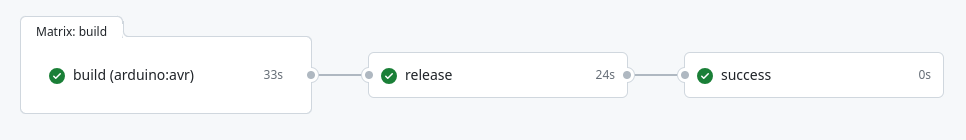
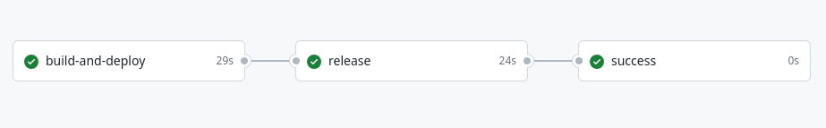

# Continuous Integration

Una delle pratiche fondamentali del *DevOps* è la *Continuous Integration*. Essa ha l'obiettivo di integrare continuamente il codice con la linea principale di sviluppo in modo da individuare tempestivamente i problemi di integrazione e migliorare la qualità del software consentendo un processo di sviluppo più rapido ed affidabile.

Di seguito verranno presentati i *workflows* di *Continuous Integration* progettati mediante l'utilizzo di *GitHub Actions*. Successivamente verranno invece descritte maggiormente in dettaglio le *GitHub Actions* sviluppate dal team ed infine verrà offerta una panoramica sugli strumenti utilizzati per l'*Automatic Dependency Update*.

Sono stati progettati quattro *workflows* principali: uno valido per i microservizi dell'*Application layer*, uno per la gestione della *Centralina di zona*, uno per la validazione dei modelli dei *Digital Twins* ed infine uno per la *verifica* e il *deploy* dell'*Azure Function* sviluppata.

## Application layer

Il primo *workflow* è stato sviluppato a supporto dei microservizi dell'*Application layer* ed è illustrato in <a href="#microserviceWorkflow">Figura 1</a>.
Il *workflow* viene eseguito ogniqualvolta viene effettuato un *push* o una *pull request*.
I *job* che vengono eseguiti sono i seguenti:

1. *validation*: per prima cosa viene validato il *wrapper* di *Gradle* al fine di verificare che esso sia valido, riconosciuto e non parte di un qualche attacco di *supply chain*.
2. *build*: dopo che il *job* *validation* è passato, viene eseguita la *build* del microservizio. Essa consiste nell'esecuzione dei test e dei controlli di qualità del codice su tutte le combinazioni di diversi sistemi operativi e diverse versioni del linguaggio utilizzato al fine di assicurare il corretto funzionamento sulle piattaforme d'interesse.
   Infine viene caricata la coverage, calcolata tramite *JaCoCo* come anticipato, sul tool cloud-based *[Codecov](https://about.codecov.io/)*.
3. *release-and-delivery*: dopo che la *build* viene completata con successo, se il *workflow* ha accesso ai segreti (quindi solo nel caso di *push* sulla *repository* originale) viene eseguita la *release* su *GitHub Release* e il *delivery* su *GitHub Packages* del microservizio stesso. Questo viene effettuato sfruttando la *GitHub Action* **release-and-delivery-action** sviluppata dal team e descritta in seguito. 
4. *documentation-deploy*: ogniqualvolta viene rilasciata una nuova versione del software viene eseguito il *job documentation-deploy* il quale si occupa del *deploy* della documentazione scritta per il microservizio. In particolare, si utilizza una *GitHub Action* sviluppata dal team, **documentation-ghp-action**, descritta in seguito.
5. *success*: esso è un *job* di *utility* progettato per verificare che tutti i *job* del *workflow* siano stati eseguiti con successo. Esso viene utilizzato ad esempio nelle politiche di *Branch protection* impostate e da *tools* come *Mergify*.

## Centralina di zona

Il secondo *workflow* è stato sviluppato a supporto della Centralina di zona - Arduino Mega 2560 - ed è illustrato in <a href="#roomControlUnitWorkflow">Figura 2</a>.
Il *workflow* viene eseguito ogniqualvolta viene effettuato un *push* o una *pull request*.
I *job* che vengono eseguiti sono i seguenti:

1. *build*: per prima cosa viene verificata la corretta *compilazione* del progetto *Arduino*.
2. *release*: dopo che il *job* di *build* è stato completato con successo, se il *workflow* ha accesso ai segreti (quindi solo nel caso di *push* sulla *repository* originale), viene eseguita la *release* su *GitHub Release*. Per semplicità, in questo caso si è sfruttato direttamente il bot *[Semantic Release](https://github.com/semantic-release/semantic-release)*.
3. *success*: esso è un *job* di *utility* progettato per verificare che tutti i *job* del *workflow* siano stati eseguiti con successo. Esso viene utilizzato ad esempio nelle politiche di *Branch protection* impostate e da *tools* come *Mergify*.

## Digital Twins

Il terzo *workflow* è stato sviluppato a supporto dei modelli *Digital Twins* modellati tramite il linguaggio *Digital Twins Definition Language* (*DTDL*).
In questo *workflow* è presente un singolo *job*  *validate*, eseguito ogniqualvolta viene effettuato il *push* o una *pull request*, il quale tramite l'ausilio della *GitHub Action* **dtdl-validator-action** sviluppata dal team verifica la validità dei modelli *DTDL* sviluppati.

## Azure Function

Il quarto *workflow* è stato sviluppato a supporto della *Azure Function* appartenente al *Digital Twins layer* ed è illustrato in <a href="#azureFunctionWorkflow">Figura 3</a>.
Il *workflow* viene eseguito ogniqualvolta viene effettuato un *push* o una *pull request*.
I *job* che vengono eseguiti sono i seguenti:

1. *build-and-deploy*: per prima cosa viene effettuata la *build* della funzione e, se ha successo e se il *workflow* ha accesso ai segreti (quindi solo nel caso di *push* sulla *repository* originale) viene eseguito il *deploy* di essa sul servizio *Azure Function*.
2. *release*: dopo che il *job* di *build-and-deploy* è stato completato con successo, se il *workflow* ha accesso ai segreti (quindi solo nel caso di *push* sulla *repository* originale), viene eseguita la *release* su *GitHub Release*. Per semplicità, in questo caso si è sfruttato direttamente il bot *[Semantic Release](https://github.com/semantic-release/semantic-release)*.
3. *success*: esso è un *job* di *utility* progettato per verificare che tutti i *job* del *workflow* siano stati eseguiti con successo. Esso viene utilizzato ad esempio nelle politiche di *Branch protection* impostate e da *tools* come *Mergify*.

## Approfondimento sulle GitHub Actions sviluppate

### release-and-delivery-action

La *GitHub Action* [`release-and-delivery-action`](https://github.com/SmartOperatingBlock/release-and-delivery-action) è stata sviluppata con lo scopo di agevolare la gestione del processo di release e di delivery di un progetto. Dapprima, l'azione si occupa di effettuare la *release* attraverso l'esecuzione dei comandi definiti in input, successivamente, se essa è stata effettuata, costruisce l'*immagine Docker* con la stessa versione della *release* appena effettuata. Infine ne effettua il delivery su un *Container Registry* fornito in input. 

Al fine di permettere un utilizzo generico è possibile escludere il processo di *release* ed effettuare solamente la costruzione e il *delivery* dell'*immagine* del container o viceversa.

### documentation-ghp-action

La *GitHub Action* [`documentation-ghp-action`](https://github.com/SmartOperatingBlock/documentation-ghp-action) è stata sviluppata con lo scopo di agevolare la generazione e la pubblicazione della documentazione dei microservizi. In particolare, vengono messi a disposizione per l'utilizzatore tre tipi di documentazione:

- *Documentazione del codice sorgente*: al fine di supportare qualsiasi linguaggio e qualsiasi *documentation engine*, i comandi di generazione vengono specificati in input da parte dell'utilizzatore.
- *Documentazione delle API REST*: per quanto riguarda la documentazione delle *API REST* si richiede l'adozione della specifica [*OpenAPI*](https://swagger.io/resources/open-api/). In particolare viene richiesto all'utilizzatore di fornire in input il *path* del file in formato *yaml* contenente la documentazione.
- *Documentazione degli eventi*: per quanto riguarda la documentazione degli eventi si richiede l'adozione della specifica [*AsyncAPI*](https://www.asyncapi.com/). In particolare viene richiesto all'utilizzatore di fornire in input il *path* del file in formato *yaml* contenente la documentazione.

Le documentazioni generate vengono pubblicate su un sito web associato alla *repository* tramite il servizio di hosting *GitHub Pages*. Al fine di permettere un utilizzo generico è possibile selezionare quali documentazioni generare.

### dtdl-validator-action

La *GitHub Action* [`dtdl-validator-action`](https://github.com/SmartOperatingBlock/dtdl-validator-action) è stata sviluppata con lo scopo di permettere la validazione dei modelli dei Digital Twins scritti in *DTDL*. In particolare, essa sfrutta il validatore [*DTDL Validator*](https://github.com/Azure-Samples/DTDL-Validator) sviluppato da *Microsoft*, adattandolo ad un utilizzo in pipeline di *Continuous Integration*.

## Automatic Dependency Update

Al fine di automatizzare l'aggiornamento delle dipendenze dei software sviluppati sono stati utilizzati i seguenti bot:

- [*Renovate*](https://www.mend.io/renovate/): configurato per creare una *pull request* su un branch ad-hoc ogniqualvolta sia presente una nuova versione di una dipendenza utilizzata nel progetto. Al fine di permettere il *DRY* delle configurazioni è stata creata una *repository* [`renovate-config`](https://github.com/AndreaGiulianelli/renovate-config) contenente tutte le configurazioni utilizzate.
- [*Mergify*](https://mergify.com/): utilizzato per velocizzare ed automatizzare i merge delle *pull request* nel branch di sviluppo principale. Come *merging strategy* è stato impiegato il *rebase*.
