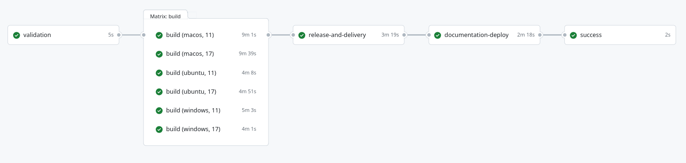

# Continuous Integration

Una delle pratiche fondamentali del *DevOps* è la *Continuous Integration*. Essa ha l'obiettivo di integrare continuamente il codice con la linea principale di sviluppo in modo da individuare tempestivamente i problemi di integrazione e migliorare la qualità del software consentendo un processo di sviluppo più rapido ed affidabile.

Di seguito verranno presentati i *workflows* di *Continuous Integration* progettati mediante l'utilizzo di *GitHub Actions*. Successivamente verranno invece descritte maggiormente in dettaglio le *GitHub Actions* sviluppate dal team.

Sono stati progettati quattro *workflows* principali: uno valido per i microservizi dell'*Application layer*, uno per la gestione della *Centralina di zona*, uno per la validazione dei modelli dei *Digital Twins* ed infine uno per la *verifica* e il *deploy* dell'*Azure Function* sviluppata.

Il primo *workflow* è stato sviluppato a supporto dei microservizi dell'*Application layer* ed è illustrato in <a href="#microserviceWorkflow">Figura 1</a>.

