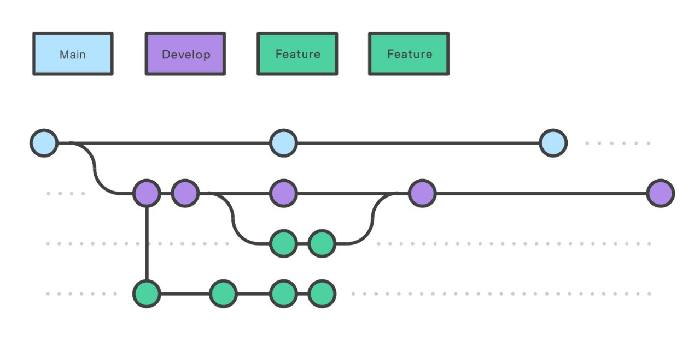

# Workflow Organization

Il progetto, il cui sviluppo è tracciato tramite repository *Git*, è stato gestito attraverso un'[organizzazione](https://github.com/SmartOperatingBlock) sul servizio di hosting di repository *GitHub*.

Seguendo le best-practice definite dal *Domain-Driven Design* è stata creata una repository separata per ciascun microservizio in quanto ognuno di essi deve essere sviluppato e versionato indipendentemente.

Considerando che molti dei microservizi sviluppati sfruttano uno stack con *Kotlin* come linguaggio di programmazione, è stata creata una *repository template* [`kotlin-template-project`](https://github.com/SmartOperatingBlock/kotlin-template-project) per velocizzare ed evitare la ripetizione delle procedure di setup. Inoltre, sono stati definiti i *template* per la creazione di *issue*, in particolare per *feature request* e *bug report* al fine di rendere la segnalazione di problemi e di richieste più chiara ed omogenea, riportando tutte le informazioni necessarie da parte dello sviluppatore.

Per una suddivisione efficace dei branch di Git è stato preso come riferimento il workflow *Git-Flow*, illustrato in <a href="#gitFlow">Figura 1</a> utilizzandolo esclusivamente come branching model.

I branch utilizzati dal workflow sono i seguenti:

- *main*: branch principale, contiene il codice associato alle varie release. Considerando che è il branch che ospita il codice di produzione, si è deciso di applicare, grazie a *GitHub*, delle politiche di *Branch protection* al fine di assicurare che, prima del merge da altri branch, i branch siano aggiornati, passino la pipeline di *Continuous Integration* e non abbiano problemi di sicurezza (controllati tramite il tool *[GitGuardian](https://www.gitguardian.com/)*). Inoltre, si è deciso di abilitare il *force push* solo agli amministratori dell'organizzazione.
- *develop*: branch di sviluppo, contiene il codice di pre-produzione integrando le feature sviluppate.
- *feature*: branch di supporto, utilizzato per lo sviluppo di una specifica feature, la quale una volta ultimata verrà integrata nel branch develop.

Inoltre, al fine di esplicitare maggiormente il significato dei commit si è scelto di utilizzare la specifica *[Conventional Commits](https://www.conventionalcommits.org/en/v1.0.0/)*, che ha semplificato l'utilizzo di tool automatici per il versionamento dell'applicazione. I tipi di commit adottati sono i seguenti:

- `build`: riguardano cambiamenti che interessano il build system oppure dipendenze esterne
- `chore`: riguardano cambiamenti generici, indica l'aggiunta o la modifica di codice correlato a attività di manutenzione generale, come la gestione dei file o altre attività che non introducono nuove funzionalità o risolvono bug.
- `ci`: riguardano cambiamenti nella configurazione dei file e negli script di *Continuous Integration*
- `docs`: riguardano cambiamenti alla documentazione di progetto
- `feat`: riguardano l'aggiunta di una nuova feature
- `fix`: riguardano la risoluzione di un bug
- `perf`: riguardano un cambiamento del codice per il miglioramento delle performance del sistema
- `refactor`: riguardano un cambiamento del codice che non risolve un bug e non aggiunge nessuna feature, quindi un'attività di refactoring.
- `style`: riguardano modifiche allo stile del codice che non impattano le funzionalità
- `revert`: riguardano l'annullamento di modifiche portate da commit precedenti.
- `test`: riguardano l'aggiunta o la modifica di test

Al fine di controllare il corretto utilizzo della specifica *Conventional Commits* ed il rispetto degli standard di qualità sul codice prodotto sono stati utilizzati i seguenti *hook* per *Git*:

- *Pre commit*: si verifica il rispetto degli standard di qualità sul codice mediante l'utilizzo dei task *Gradle* forniti dalle suite di *Quality Assurance* descritte nel seguito
- *Commit msg*: si verifica il rispetto della specifica *Conventional Commit*
- *Post commit*: si verifica che il commit prodotto sia *signed*. In caso di mancata firma del commit verrà visualizzato un warning utile per lo sviluppatore, ma non verrà fatto fallire

Essi sono stati configurati attraverso il plugin *Gradle* [`gradle-pre-commit-git-hooks`](https://github.com/DanySK/gradle-pre-commit-git-hooks).

Infine, tra le tecniche di *Git* utilizzate, si è scelto di utilizzare come *merging strategy* il *rebase* al posto del tradizionale *merge*. Allo stesso modo si è configurata l'esecuzione del *pull* tramite *rebase*.